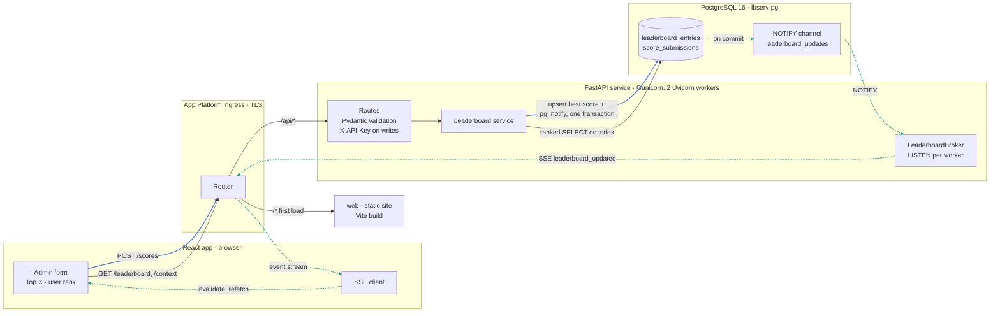

# lbserv

A REST API and small React UI for a real-time gaming leaderboard. Users submit scores per game;
the service ranks them instantly and pushes updates to connected browsers.

- **Backend:** Python 3.12, FastAPI, Pydantic v2, SQLAlchemy 2 (async) + asyncpg, Alembic,
  Gunicorn + Uvicorn workers
- **Database:** PostgreSQL 16 (DigitalOcean managed, 1 GiB node)
- **Frontend:** React 19, Vite, TanStack Query, react-hook-form, all API code generated from OpenAPI
- **Errors:** [RFC 9457](https://www.rfc-editor.org/rfc/rfc9457) `application/problem+json`
- **Ops:** DigitalOcean App Platform, gitleaks, GitHub Actions

## Architecture



Blue edges are the write path, dotted green edges are the live-update path, and the rest are reads
and routing.

- **Write a score:** the admin form validates input with the generated zod schema and sends
  `POST /api/v1/games/{game}/scores` with `X-API-Key`. In one transaction the service logs the
  submission, upserts the user's best score, and calls `pg_notify`. The response returns the best
  score, rank, and whether it improved.
- **Read the board:** TanStack Query calls the generated SDK for the top X or a user's context. The
  service walks the ranking index (score descending, earliest first) and returns JSON, which the
  browser validates against zod. Errors arrive as RFC 9457 problem details.
- **Push live updates:** when the write commits, PostgreSQL notifies each worker's LISTEN
  connection. Workers stream `leaderboard_updated` over SSE to browsers watching that game, which
  invalidate their cached queries and refetch, so the database stays the source of truth.
- **Shared contract:** Pydantic models export `openapi/openapi.json`, which generates the
  frontend's types, zod schemas, SDK, and SSE client.

## API

Interactive docs: `/api/docs`. Contract: [`openapi/openapi.json`](openapi/openapi.json).

| Method | Path | Auth | Description |
|---|---|---|---|
| `GET` | `/api/health` | | Liveness |
| `GET` | `/api/ready` | | Readiness (checks the DB) |
| `GET` | `/api/v1/games` | | List games |
| `POST` | `/api/v1/games` | API key | Create a game `{id, name}` |
| `POST` | `/api/v1/games/{game_id}/scores` | API key | Submit `{user_id, score}`; returns best score, rank, `improved` |
| `GET` | `/api/v1/games/{game_id}/leaderboard?limit=10` | | Top X users (1–100) |
| `GET` | `/api/v1/games/{game_id}/users/{user_id}/context?neighbors=1` | | A user's rank plus users directly above/below (0–10) |
| `GET` | `/api/v1/games/{game_id}/events` | | Server-Sent Events: `leaderboard_updated` |

Writes require an `X-API-Key` header.

### Ranking rules

- The leaderboard keeps each user's **best** score per game; every submission is still stored in
  `score_submissions`.
- Order: higher score first; ties go to whoever reached the score **first**; then `user_id`.
  Ranks are unique positions (1, 2, 3, …).
- Scores are integers `0 … 2^53-1` so they stay exact in JavaScript.

### Errors

```json
{
  "type": "https://lbserv.dev/problems/validation-failed",
  "title": "Validation failed",
  "status": 422,
  "detail": "The request contains invalid parameters.",
  "instance": "/api/v1/games/tetris/scores",
  "code": "validation-failed",
  "errors": [{ "detail": "Input should be greater than or equal to 0", "pointer": "#/score" }]
}
```

Codes: `validation-failed` (422), `invalid-api-key` (401), `game-not-found` (404),
`user-not-ranked` (404), `game-already-exists` (409), `internal-error` (500). Generic HTTP errors use
`"type": "about:blank"`.

### How real-time works

The score upsert and `pg_notify('leaderboard_updates', …)` run in one transaction. Each API instance
holds one `LISTEN` connection and forwards committed events to its SSE subscribers for that game.
The UI refetches affected queries when an event arrives, so the tables stay correct even when
events are dropped or the connection is lost.

Scaling note: rank lookups count the rows ahead of a user using the ranking index, which is
O(rank). That's fine for large leaderboards on Postgres. If a single game reaches many millions of
active players, add a Redis sorted-set cache in front of it.

## Type safety: no manual typing on the frontend

Pydantic models (`backend/app/schemas.py`) → `openapi/openapi.json` → `frontend/src/api/generated/`
(TypeScript types, zod schemas, fetch SDK with runtime request/response validation, TanStack Query
options, SSE client).

Enforced by:

1. **ESLint** (`frontend/eslint.config.js`): no API-shaped type declarations, no snake_case
   property signatures, no `as` assertions, no raw `fetch`/`EventSource`/axios/zod imports.
2. **CI drift check** (`make contract`): regenerates both artifacts and fails on any diff.
3. **Backend test** `tests/test_openapi.py`: the committed contract matches the app.
4. **Claude Code**: `CLAUDE.md`, `.claude/rules/frontend-api-types.md`, and a PreToolUse hook that
   blocks edits to generated files.

Change the API like this: edit the Pydantic schema, run `make openapi gen`, then use the new types.

## Local development

The project runs inside the `shellport` dev container at `/workspaces/Leaderboard`, with Postgres
from `docker compose` on the host. It also works on any machine with `uv`, Node 22+, and Docker.

```bash
docker compose up -d db              # Postgres 16 on :5432 (creates lbserv and lbserv_test)
make install
cp backend/.env.example backend/.env # inside the dev container use host.docker.internal instead of localhost
make migrate
make dev-api                         # http://localhost:8000/api/docs
make dev-web                         # http://localhost:5173
```

Without a dev container, `docker compose up` also runs the API with reload on :8000.

Checks:

```bash
make lint test contract gitleaks
```

### Secrets & gitleaks

- Never commit `.env` files; `.env.example` holds safe defaults only.
- `pipx install pre-commit && pre-commit install` enables gitleaks, ruff, ESLint, and the contract
  check before each commit.
- CI scans the full git history with gitleaks on every push and PR. Allowlisted items are in
  `.gitleaks.toml` (generated files, lockfiles, local placeholders only).

## Deploying to DigitalOcean App Platform

The spec in [`.do/app.yaml`](.do/app.yaml) defines:

- `api`: a service built from `backend/Dockerfile`, running Gunicorn with 2 Uvicorn workers,
  health-checked at `/api/health`
- `migrate`: a `PRE_DEPLOY` job that runs `alembic upgrade head`
- `web`: a static site built from `frontend/`
- `pg`: the managed PostgreSQL 16 cluster `lbserv-pg` (database `lbserv`), created separately
- ingress rules: `/api` goes to `api` and everything else goes to `web`, so it's one origin with no
  CORS

```bash
doctl databases create lbserv-pg --engine pg --version 16 --region nyc3 --size db-s-1vcpu-1gb --num-nodes 1
doctl databases db create <cluster-id> lbserv
doctl apps create --spec .do/app.yaml
# then set the API_KEY secret in the control panel and redeploy
```

### Database connections

A 1 GiB node allows 22 backend connections. Each Gunicorn worker holds 1 LISTEN connection plus
a SQLAlchemy pool (`DB_POOL_SIZE` + `DB_MAX_OVERFLOW`):

| | Per worker | Per instance (2 workers) | Deploy overlap + migrate job |
|---|---|---|---|
| Default | ≤ 5 | ≤ 10 | ≤ 21 |

SSE viewers don't consume database connections. When scaling out, lower the pool per worker or put
DigitalOcean's PgBouncer pool in front of regular queries (LISTEN must stay on a direct connection).

### Operations

```bash
BASE_URL=https://<app>.ondigitalocean.app SEED_API_KEY=... make seed    # placeholder games
BASE_URL=https://<app>.ondigitalocean.app SMOKE_API_KEY=... make smoke  # creates a smoke-* game
```

Notes:

- The GitHub app must have access to `dtmesa/lbserv`.
- `doctl apps update --spec .do/app.yaml` resets `SECRET` values to the placeholders in the file.
  Edit secrets in the control panel, or start from `doctl apps spec get <app-id>`.
- SSE streams stay open behind App Platform's proxy. The server sends a comment every 15s, and
  clients reconnect automatically after deploys.
